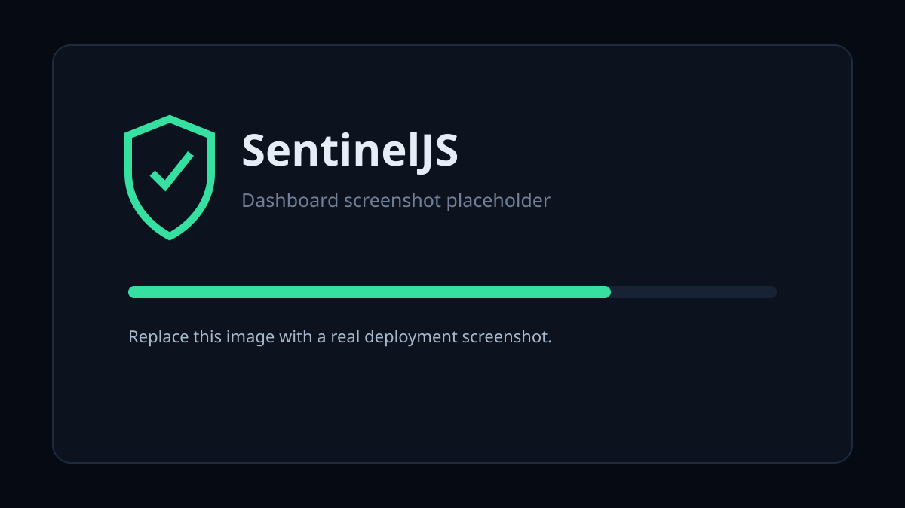
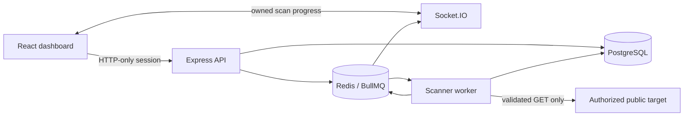

# 🛡️ SentinelJS

**Explainable, passive web security auditing for targets you are authorized to assess.**

SentinelJS is a JavaScript security engineering portfolio project: an authenticated React dashboard backed by an Express API, PostgreSQL, Redis, BullMQ workers, Socket.IO progress updates, and a modular passive scanner. It observes the response a normal `GET` request receives; it does not exploit findings, submit forms, brute-force credentials, or bypass authentication.

> **Only scan systems you own or have explicit permission to test.**



## What it does

- Checks CSP, HSTS, MIME sniffing protection, referrer policy, permissions policy, and frame restrictions.
- Reviews `Secure`, `HttpOnly`, and `SameSite` cookie attributes without storing cookie values.
- Validates HTTPS certificates and hostnames, records basic TLS details, and observes HTTP-to-HTTPS redirects.
- Flags a narrowly defined unsafe CORS combination, exposed technology headers, passive error leakage, mixed content, and insecure forms.
- Produces a reproducible 0–100 score with a deduction beside every finding.
- Stores user-owned scan history and exports completed reports as escaped HTML or JSON.
- Streams worker state to authenticated, ownership-checked Socket.IO rooms.
- Defends the network boundary with protocol/port restrictions, DNS validation, address pinning, redirect revalidation, timeouts, and response limits.

SentinelJS performs limited passive auditing. Its observations alone cannot prove that a website is secure or vulnerable. A missing control is reported as risk context—not proof of exploitability.

## Architecture



The API validates identity and ownership, the queue separates interactive work from scanning, and the worker owns outbound networking. Checks receive a normalized response and return a shared finding shape, so a new check is a small module added to `server/src/scanner/checks/index.js`.

## Technology

React 19, Vite, Tailwind CSS 4, Recharts, Node.js 22, Express 5, Prisma, PostgreSQL, Redis, BullMQ, Socket.IO, Zod, Vitest, Docker Compose, ESLint, Prettier, and GitHub Actions.

## Quick start with Docker

Requirements: Docker Engine with Compose v2.

```bash
cp .env.example .env
# Replace JWT_SECRET and POSTGRES_PASSWORD in .env with strong random values.
docker compose up --build
```

Open `http://localhost:8080`. The intentionally misconfigured demonstration target is exposed at `http://localhost:8081` for inspection. SentinelJS deliberately rejects localhost and Docker-private addresses; test the detection modules with `npm test`, or deploy the demo target to an isolated public host you control before scanning it. This prevents a “demo bypass” from weakening production SSRF protections.

For HTTPS deployment, terminate TLS at a trusted reverse proxy, set `CLIENT_ORIGIN` to the public origin, and set `COOKIE_SECURE=true`.

## Local development

Requirements: Node.js 22+, PostgreSQL 17+, and Redis 8+.

```bash
cp .env.example .env
npm install
npm run db:generate
npm run db:migrate
npm run dev
```

The web UI runs at `http://localhost:5173`, API at `http://localhost:4000`, and demo target at `http://localhost:3000`. Run quality gates with:

```bash
npm run format:check
npm run lint
npm test
npm run test:integration
npm run build
```

The integration suite expects the `DATABASE_URL` database to be disposable and already migrated.

## Usage

1. Register with an email and a password of at least 12 characters.
2. Enter an absolute `http://` or `https://` URL for an authorized public target.
3. Follow `QUEUED → RESOLVING → CONNECTING → SCANNING → ANALYZING → COMPLETED` live.
4. Filter findings by severity or category and review evidence, impact, and mitigation.
5. Download a JSON or standalone HTML report.

Example report excerpt:

```json
{
  "target": "https://example.com/",
  "score": 82,
  "summary": {
    "totalFindings": 2,
    "notice": "This score reflects limited passive checks and does not prove that the target is secure or vulnerable."
  },
  "findings": [
    { "severity": "HIGH", "deduction": 12 },
    { "severity": "MEDIUM", "deduction": 6 }
  ]
}
```

See [the scoring specification](docs/SCORING.md) for exact weights and [the threat model](docs/THREAT_MODEL.md) for trust boundaries and limitations.

## API

| Method   | Path                                      | Purpose                                       |
| -------- | ----------------------------------------- | --------------------------------------------- |
| `POST`   | `/api/auth/register`                      | Create an account and session                 |
| `POST`   | `/api/auth/login`                         | Create a session                              |
| `POST`   | `/api/auth/logout`                        | Clear the session                             |
| `POST`   | `/api/scans`                              | Validate and enqueue an authorized target     |
| `GET`    | `/api/scans`                              | List owned scans; optionally filter by status |
| `GET`    | `/api/scans/:id`                          | Read one owned scan and findings              |
| `GET`    | `/api/scans/:id/findings`                 | Filter findings by severity/category          |
| `GET`    | `/api/scans/:id/report?format=json\|html` | Export a completed scan                       |
| `DELETE` | `/api/scans/:id`                          | Delete a completed or failed scan             |
| `GET`    | `/api/health`                             | Liveness response                             |

Responses use `{ "data": ... }` on success and `{ "error": { "code", "message", "details" } }` on failure.

## Project structure

```text
client/                  React dashboard, pages, hooks, API client
server/prisma/           schema and versioned migration
server/src/controllers/  HTTP orchestration
server/src/jobs/         BullMQ queue and worker
server/src/scanner/      network policy, fetcher, checks, scoring
server/src/services/     authentication, scans, reports
server/tests/            unit and PostgreSQL integration tests
demo/                    intentionally misconfigured safe HTTP service
docker/                  container and nginx configuration
docs/                    scoring model, threat model, screenshots
.github/workflows/       pull-request and main-branch CI
```

## Security model and limitations

SentinelJS permits only HTTP(S) on ports 80/443. It rejects URL credentials, local names, loopback, private, link-local, carrier-grade NAT, reserved/documentation, multicast, and known metadata destinations. Every DNS result must be public; the selected address is pinned into the socket lookup and checked after connection; every redirect repeats validation. Requests have redirect, time, and byte limits.

Production should still enforce outbound firewall rules. DNS resolvers, public reverse proxies, compromised public hosts, and the target response remain external trust dependencies. The scanner sees one unauthenticated page response and does not execute JavaScript, crawl the site, enumerate endpoints, or replace a professional assessment. Read [docs/THREAT_MODEL.md](docs/THREAT_MODEL.md) before deployment.

## Roadmap

- Signed report provenance and configurable retention policies
- Per-organization roles and target allowlists
- Scheduled scans with change comparisons
- Additional passive checks with fixture-backed tests
- Metrics, tracing, and worker autoscaling guidance

## Contributing

See [CONTRIBUTING.md](CONTRIBUTING.md). Security reports should not be filed publicly; use the private reporting instructions in [SECURITY.md](SECURITY.md).

## License

MIT — see [LICENSE](LICENSE).
